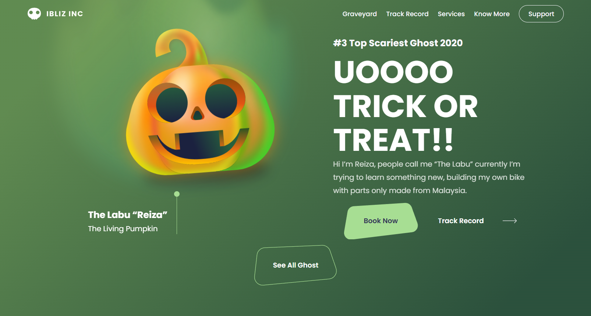
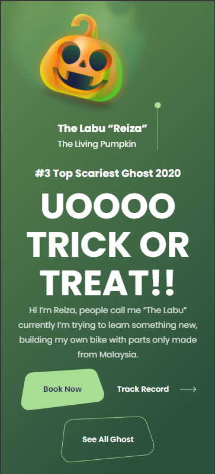

<h1>Trick or treat</h1>

<h2>
📕 Sobre o projeto 
</h2>

Nesse projeto foi utilizado Html e CSS para criar o design do site, assim como a animação e a responsividade.

<h2>
🔨 Ferramentas
</h2> 

<ul>
<li>HTML</li>
<li>CSS</li>
</ul>

